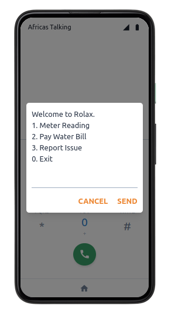
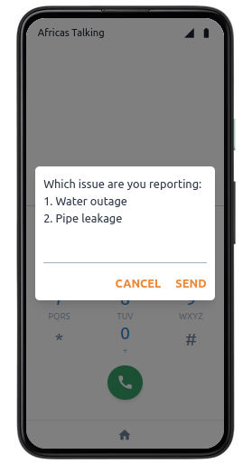
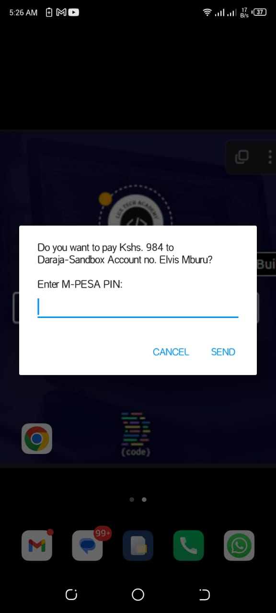
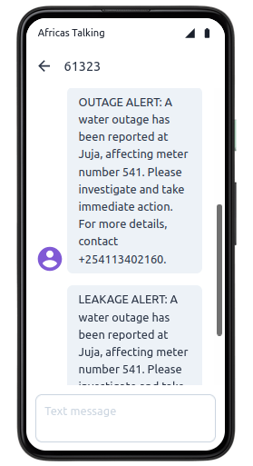

# rolax_ussd

## Description

This microservice is part of a larger Water Management and Monitoring system. It provides a USSD interface for personalized water consumption monitoring and bill payments, enabling users to interact with the system through their mobile phones. The service also includes an SMS feature that allows households to send alerts to the water company in case of water outages or issues.

## Key Features

This microservice plays a vital role in the larger Water Management and Monitoring system by offering key functionalities to enhance water usage tracking, bill payments, and issue reporting through USSD and SMS. Below are the standout features of the service:

### 1. USSD Interface for Monitoring and Payments

- **Personalized Monitoring**: Users can dial a USSD code to instantly check their water usage.
- **Real-Time Bill Payments**: Allows users to make payments directly through USSD without needing internet access.
- **Interactive Menu**: Offers users a simple, step-by-step menu to navigate services:
  - Check water consumption
  - Pay pending bills
  - Report issues (triggering the SMS system)

|        |        |
|:--------------------------------------:|:--------------------------------------:|
| USSD Home Menu                         | USSD Issue Reporting Menu                         |

### 2. Payment Integration

This project integrates with **Intasend**, which wraps the **MPESA Daraja API** for seamless payment processing. This integration allows users to make payments directly through the USSD interface, ensuring secure and efficient transactions.

|        |
|:--------------------------------------:|
| Payments STK PUSH                      |

### 3. SMS Alerts for Issue Reporting

- **Outage Reporting**: End-users can send SMS alerts to the water company to report outages or challenges with water service.
- **Customizable Alert Messages**: Users can include their account number and a description of the issue in a predefined SMS format.
- **Automatic Notification to Water Company**: Once the SMS is received, the system logs the issue and sends a confirmation response to the user.

|   |
|:--------------------------------------:|
| SMS Alerts                             |

## Technologies Used

- Python, Flask
- [Africas Talking USSD and SMS APIs](https://africastalking.com/)
- [Intasend Payment Gateway](https://intasend.com/)
